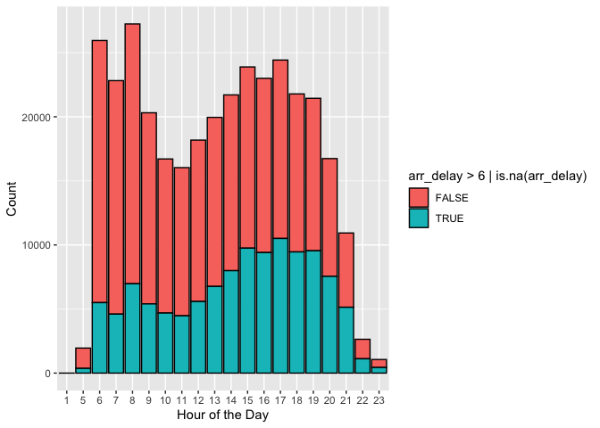
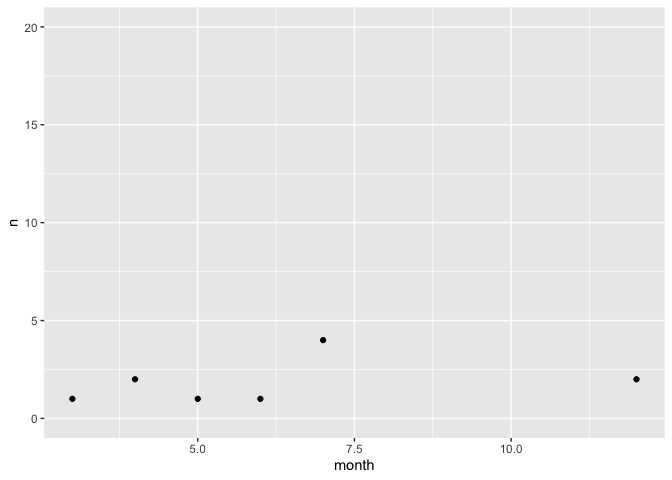

Homework2_Stat433
================
Jake White
2022-10-10

## I have found that flights that depart within the late night/early morning time gap seem to have the least amount of delays. That being said, these are the most optimal times to avoid delays. I wanted to check on if this choice depended on seasonal changes, destinations per flight, or the distance of the flight itself. The seasonal table seemed to show a stagnant number of delays (or lack thereof) throughout all seasons. This could be due to the mild and consistent weather that is found at night through most seasons. When checking for destinations, the Charlotte Airport showed a substantial amount of delays during the night time. Therefore, if you’re flying at night to avoid delays, also try to avoid flying into Charlotte. The last pattern I attempted to look into was flight distance. A significant outlier presented itself as a flight distance of 529 feet showed a staggering 303 delays. Unsure if this is a data anomaly or possibly an error in the table, this number should be taken with caution nonetheless. I was under the initial assumption that longer flights would show a greater number of delays regardless of departure time, but the data seems to show otherwise.

``` r
library(dplyr)
```

    ## 
    ## Attaching package: 'dplyr'

    ## The following objects are masked from 'package:stats':
    ## 
    ##     filter, lag

    ## The following objects are masked from 'package:base':
    ## 
    ##     intersect, setdiff, setequal, union

``` r
library(nycflights13)
library(ggplot2)
library(tidyr)
```

``` r
flights %>%
    ggplot(aes(x=factor(hour), fill=arr_delay>6 | is.na(arr_delay))) + geom_bar(color="black") + xlab("Hour of the Day") + ylab("Count") 
```

<!-- -->

## It seems as though the evening flights (Hours 15-19) are typically the flights to avoid when trying to avoid delays.The early morning/very late night times are the best times to fly to avoid delays.

\#Checking if this is dependent on season

``` r
seasonal = flights %>% 
  mutate(time = dep_time) %>% 
  separate(time, into = c("dep_hour", "dep_min"), sep = -2) %>% 
  filter(dep_hour == 3) %>% 
  group_by(month) %>% 
  summarise(n = n())


ggplot(seasonal, aes(x = month, y = n)) + geom_point() + ylim(0,20)
```

<!-- -->

\#It looks as though this inference does not depend on seasons, as the
it shows a relatively linear number of delays per seasonal group. The
consistency of these results may be due to the fact that throughout most
seasons, the night time weather is typically stagnant (besides winter).

\#Checking if this is dependent on destination

``` r
destinational = flights %>% 
  mutate(time = dep_time) %>% 
  separate(time, into = c("dep_hour", "dep_min"), sep = -2) %>% 
  filter(dep_hour == 4 | dep_hour == 3 | dep_hour == 2) %>% 
  group_by(dest) %>% 
  summarise(n = n()) %>%
  arrange(desc(n))

destinational
```

    ## # A tibble: 25 × 2
    ##    dest      n
    ##    <chr> <int>
    ##  1 CLT     303
    ##  2 BQN      12
    ##  3 BOS       8
    ##  4 PSE       7
    ##  5 SJU       7
    ##  6 BUF       4
    ##  7 FLL       4
    ##  8 LAX       4
    ##  9 TPA       4
    ## 10 CAK       3
    ## # … with 15 more rows

\#The Charlotte Airport appears to be a significant outlier among the
rest of the destination airports in the data in terms of delays during
the night time. It’s clear to note that the choice of flying at night is
relatively dependent on where you are planning to fly to. If Charlotte
is your desired destination, then flying during these night hours might
not be your best option.

\#Checking if this is dependent on flight distance

``` r
distance = flights %>% 
  mutate(time = dep_time) %>% 
  separate(time, into = c("dep_hour", "dep_min"), sep = -2) %>% 
  filter(dep_hour == 4 | dep_hour == 3 | dep_hour == 2) %>% 
  group_by(distance) %>% 
  summarise(n = n()) %>%
  arrange(desc(n))

distance
```

    ## # A tibble: 29 × 2
    ##    distance     n
    ##       <dbl> <int>
    ##  1      529   303
    ##  2     1576    12
    ##  3      187     8
    ##  4     1598     7
    ##  5     1617     7
    ##  6      301     4
    ##  7      209     3
    ##  8      397     3
    ##  9     1005     3
    ## 10     2475     3
    ## # … with 19 more rows

\#Providing similar results to the last table, this data shows a
significant outlier at 529 feet. I was under the assumption that a
flight with longer distance would provide more delays regardless of
time. This assumption was made due to my thought that the longer the
flight the higher chance the flight would have of running into multiple
different weather packets. If this data is outputting correctly, these
results are dependent on if you’re fliying at a distance of \~530 feet
or not.
