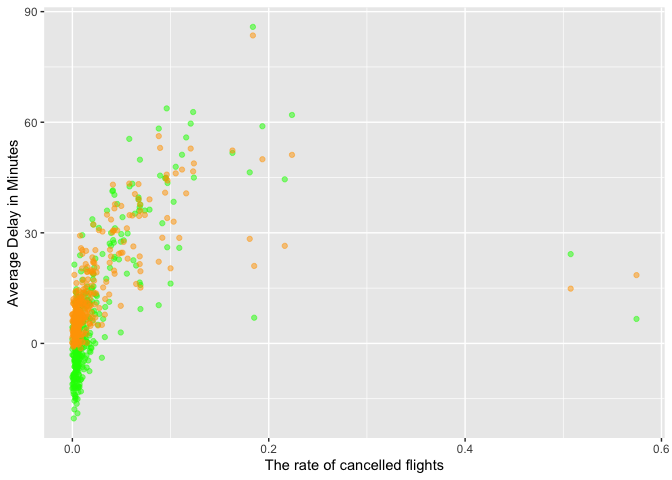

Homework1_Stat433_JakeWhite
================
Jake White
2022-09-26

``` r
library(dplyr)
```

    ## 
    ## Attaching package: 'dplyr'

    ## The following objects are masked from 'package:stats':
    ## 
    ##     filter, lag

    ## The following objects are masked from 'package:base':
    ## 
    ##     intersect, setdiff, setequal, union

``` r
library(nycflights13)
library(ggplot2)
```

\#Q1

``` r
q1 <- filter(flights, is.na(dep_time))
q1
```

    ## # A tibble: 8,255 × 19
    ##     year month   day dep_time sched_dep_time dep_delay arr_time sched_arr_time
    ##    <int> <int> <int>    <int>          <int>     <dbl>    <int>          <int>
    ##  1  2013     1     1       NA           1630        NA       NA           1815
    ##  2  2013     1     1       NA           1935        NA       NA           2240
    ##  3  2013     1     1       NA           1500        NA       NA           1825
    ##  4  2013     1     1       NA            600        NA       NA            901
    ##  5  2013     1     2       NA           1540        NA       NA           1747
    ##  6  2013     1     2       NA           1620        NA       NA           1746
    ##  7  2013     1     2       NA           1355        NA       NA           1459
    ##  8  2013     1     2       NA           1420        NA       NA           1644
    ##  9  2013     1     2       NA           1321        NA       NA           1536
    ## 10  2013     1     2       NA           1545        NA       NA           1910
    ## # … with 8,245 more rows, and 11 more variables: arr_delay <dbl>,
    ## #   carrier <chr>, flight <int>, tailnum <chr>, origin <chr>, dest <chr>,
    ## #   air_time <dbl>, distance <dbl>, hour <dbl>, minute <dbl>, time_hour <dttm>

# The other rows that are missing from this other than dep_time are dep_delay, arr_time, arr_delay, and air_time. This could be a sign that these flights were cancelled but still tracked as part of the data.

\#Q2

``` r
q2 <- mutate(flights, dep_time = 60 * floor(dep_time/100) + (dep_time - floor(dep_time/100) * 100), sched_dep_time = 60 * floor(sched_dep_time/100) + (sched_dep_time - floor(sched_dep_time/100) * 100))

q2
```

    ## # A tibble: 336,776 × 19
    ##     year month   day dep_time sched_dep_time dep_delay arr_time sched_arr_time
    ##    <int> <int> <int>    <dbl>          <dbl>     <dbl>    <int>          <int>
    ##  1  2013     1     1      317            315         2      830            819
    ##  2  2013     1     1      333            329         4      850            830
    ##  3  2013     1     1      342            340         2      923            850
    ##  4  2013     1     1      344            345        -1     1004           1022
    ##  5  2013     1     1      354            360        -6      812            837
    ##  6  2013     1     1      354            358        -4      740            728
    ##  7  2013     1     1      355            360        -5      913            854
    ##  8  2013     1     1      357            360        -3      709            723
    ##  9  2013     1     1      357            360        -3      838            846
    ## 10  2013     1     1      358            360        -2      753            745
    ## # … with 336,766 more rows, and 11 more variables: arr_delay <dbl>,
    ## #   carrier <chr>, flight <int>, tailnum <chr>, origin <chr>, dest <chr>,
    ## #   air_time <dbl>, distance <dbl>, hour <dbl>, minute <dbl>, time_hour <dttm>

\#Q3

``` r
q3 <-flights %>%
  mutate(dep_date = lubridate::make_datetime(year, month, day)) %>%
  group_by(dep_date) %>%
  summarise(cancelled = sum(is.na(dep_delay)), 
            n = n(),
            mean_arr_delay = mean(arr_delay,na.rm=TRUE),
            mean_dep_delay = mean(dep_delay,na.rm=TRUE)) %>%
    ggplot(aes(x= cancelled/n)) + 
    geom_point(aes(y=mean_arr_delay), color='green', alpha=0.5) + 
    geom_point(aes(y=mean_dep_delay), color='orange', alpha=0.5) + 
    ylab('Average Delay in Minutes') + 
    xlab('The rate of cancelled flights')

q3
```

<!-- --> \# There does
not seem to be significant correlation between cancelled flights and the
delays. It seems that only a select number of flights share a higher
cancellation rate when the delay time is increased.
